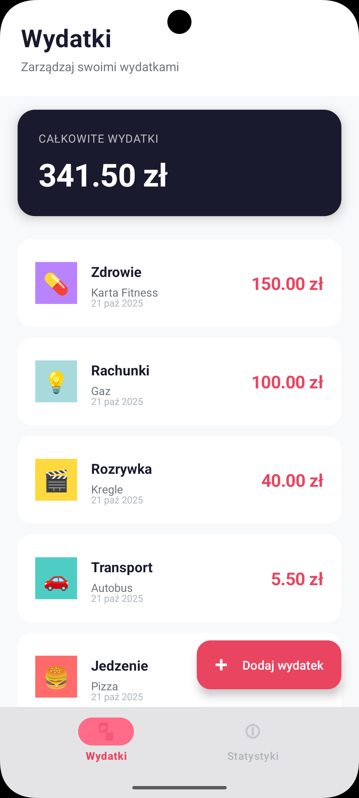
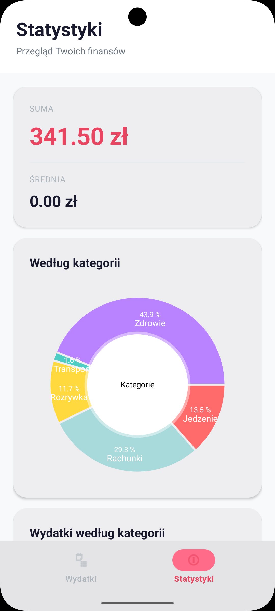
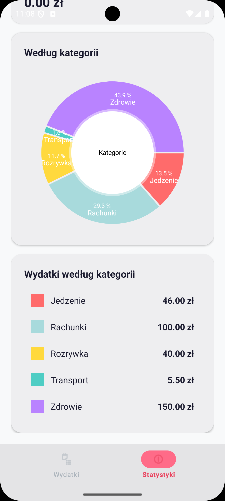
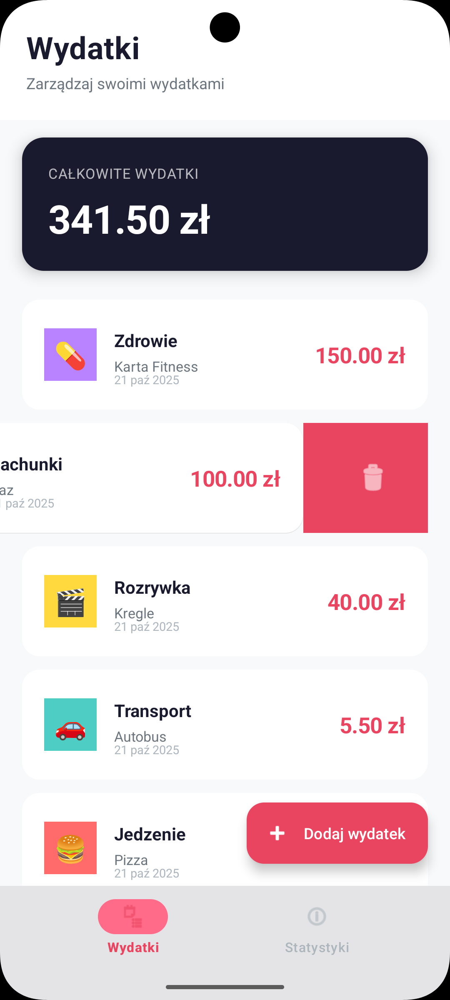

# 💰 ExpenseTracker

A modern, minimalist mobile app for tracking personal expenses, built with Android Studio using Kotlin and Material Design 3.


## 📸 Screenshots

<p align="center">
  
  
  
  
</p>

## 📱 Features

- ✅ **Expense Management** - Add, edit, and delete expenses
- 📊 **Statistics** - Visualize expenses by category with interactive charts
- 🎨 **8 Expense Categories** - Food, Transport, Entertainment, Shopping, Bills, Health, Education, Other
- 💾 **Local Database** - Room Database ensures persistent data storage
- 🌙 **Modern Design** - Minimalist interface with Material Design 3
- 📱 **Responsive UI** - Smooth animations and intuitive navigation
- 👈 **Swipe to Delete** - Quick gesture-based deletion with undo option

## 🛠️ Technologies

### Architecture
- **MVVM** (Model-View-ViewModel)
- **Repository Pattern**
- **Single Activity Architecture**

### Libraries and Tools
- **Kotlin** - Programming language
- **Android Jetpack:**
  - Room - Local database
  - LiveData - Reactive data management
  - ViewModel - UI state management
  - Navigation Component - Navigation between fragments
  - Data Binding - UI-data binding
- **Material Design 3** - UI components
- **MPAndroidChart** - Charts and visualizations
- **Coroutines** - Asynchronous operations

## 📂 Project Structure

```
app/
├── src/main/
│   ├── java/com/example/expensetracker/
│   │   ├── data/
│   │   │   ├── database/      # Room Database
│   │   │   ├── model/         # Data entities
│   │   │   └── repository/    # Data access layer
│   │   ├── ui/
│   │   │   ├── adapter/       # RecyclerView adapters
│   │   │   ├── fragment/      # UI fragments
│   │   │   ├── helper/        # Helper classes
│   │   │   └── viewmodel/     # ViewModels
│   │   ├── utils/             # Utility classes
│   │   └── MainActivity.kt    # Main activity
│   └── res/
│       ├── layout/            # XML layout files
│       ├── values/            # Colors, styles, strings
│       └── drawable/          # Graphics resources
```

## 🚀 Installation and Setup

### Requirements
- Android Studio Hedgehog (2023.1.1) or newer
- Android SDK 24 or higher
- Kotlin 1.9+

### Installation Steps

1. **Clone the repository**
   ```bash
   git clone https://github.com/mturczak/ExpenseTracker.git
   cd ExpenseTracker
   ```

2. **Open project in Android Studio**
   - File → Open → Select project folder

3. **Sync project with Gradle files**
   - Android Studio will automatically download required dependencies

4. **Run the app**
   - Connect an Android device or start an emulator
   - Click "Run" (▶️) in Android Studio

## 💡 How to Use

### Adding an Expense
1. Click the "Add expense" button (FAB)
2. Enter amount, select category, and add description
3. Select expense date
4. Click "Save"

### Viewing Statistics
1. Go to the "Statistics" tab
2. View total expenses and average
3. Browse the pie chart by category
4. Check detailed list of expenses in each category

### Editing/Deleting an Expense
- **Edit:** Click on an expense in the list
- **Delete (method 1):** Swipe expense to the left ← and click "UNDO" if you change your mind
- **Delete (method 2):** Long press on expense and confirm deletion in dialog

## 🎨 Design

The app uses a modern, minimalist design with:
- Rounded corners (16-20dp)
- Subtle color palette
- Emoji as category icons
- Clean cards and spacing
- Intuitive bottom navigation

### Color Palette
- **Primary:** `#1A1A2E` - Dark blue
- **Accent:** `#E94560` - Coral red
- **Background:** `#F8F9FA` - Light gray
- **Surface:** `#FFFFFF` - White

## 📊 Future Features

- [ ] Export data to CSV/PDF
- [ ] Filters and expense search
- [ ] Monthly budgets with alerts
- [ ] Dark Mode
- [ ] Cloud synchronization
- [ ] Multi-currency support
- [ ] Recurring expense reminders
- [ ] Backup and restore data

## 👤 Author

**Miłosz Turczak**

- GitHub: [@mturczak](https://github.com/mturczak)
- Email: [available through GitHub]

## 📄 License

This project is available under the MIT License - see the [LICENSE](LICENSE) file for details.

## 🤝 Contributing

Issues and Pull Requests are welcome! All contributions are appreciated.

1. Fork the project
2. Create a feature branch (`git checkout -b feature/NewFeature`)
3. Commit your changes (`git commit -m 'Add new feature'`)
4. Push to the branch (`git push origin feature/NewFeature`)
5. Open a Pull Request

## 🙏 Acknowledgments

- Material Design 3 for UI components
- MPAndroidChart for chart library
- Android Developers community for support

---

⭐ If you like this project, leave a star on GitHub!
